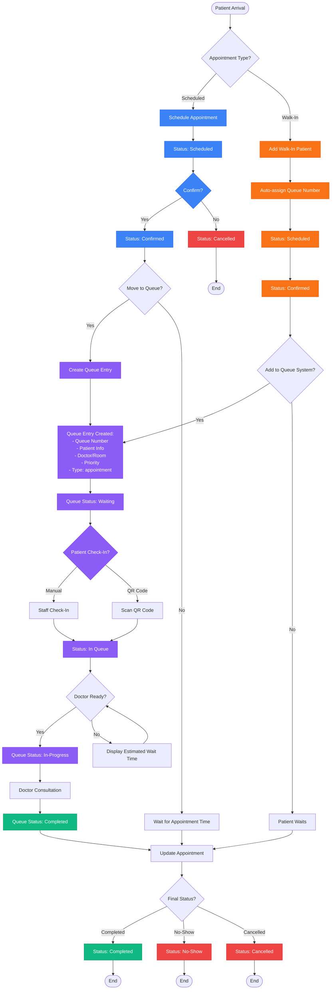
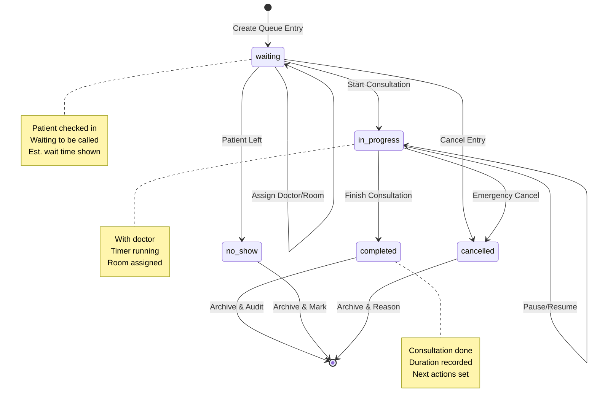
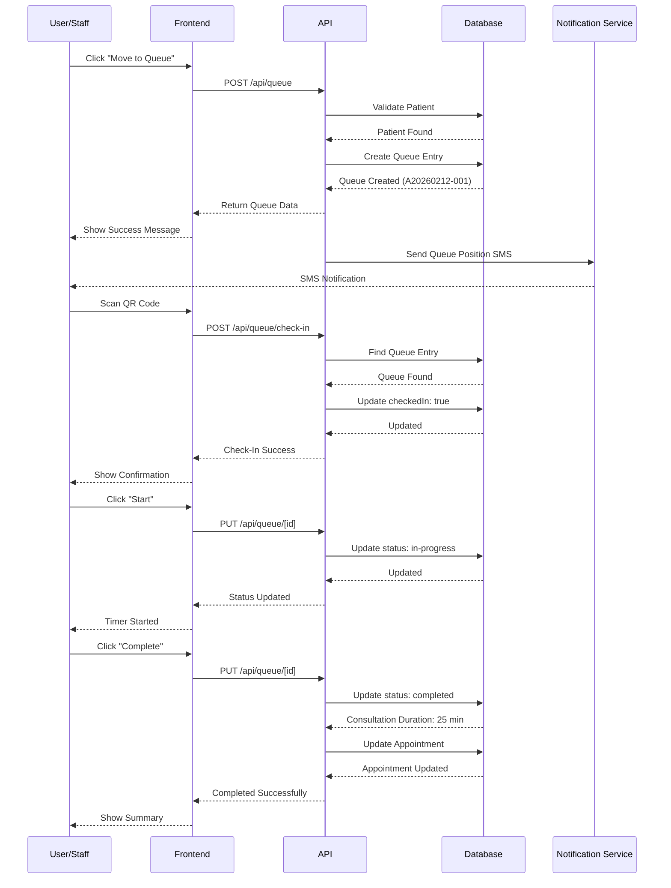
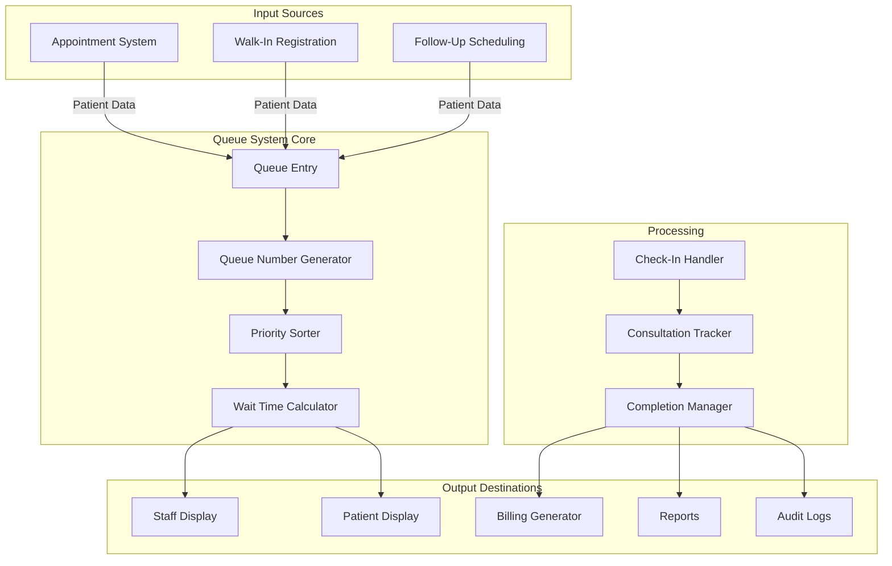
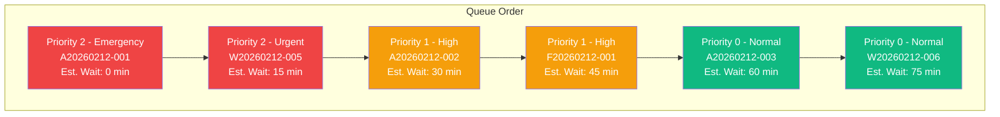
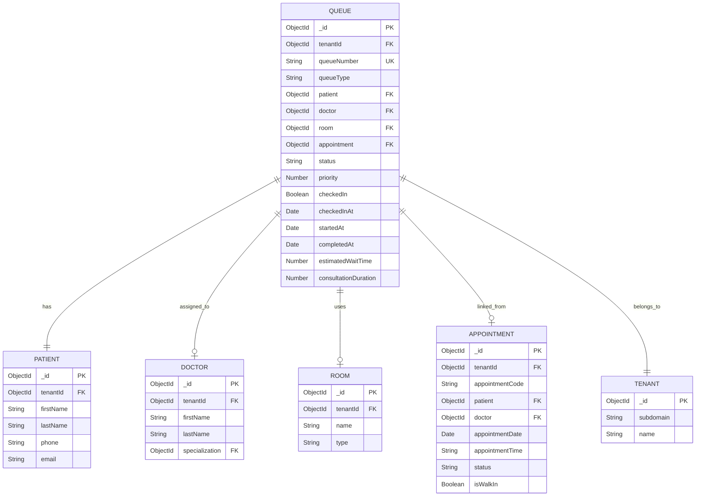

# Appointment & Queue Workflow - Visual Diagrams

This document contains all the visual diagrams for the Appointment and Queue Management System workflow.

## Complete Workflow Diagram



## Queue Status State Machine



## System Architecture

```mermaid
graph LR
    subgraph "User Interfaces"
        A[Appointments Page]
        B[Queue Management Page]
        C[Patient Display Screen]
        D[Mobile App]
        E[Check-In Kiosk]
    end
    
    subgraph "Queue Management System"
        Q[Queue API]
        QDB[(Queue Database)]
        QS[Queue Service]
        QO[Queue Optimizer]
        QN[Notification Service]
    end
    
    subgraph "Related Systems"
        PT[(Patient Records)]
        DR[(Doctor Schedules)]
        RM[(Room Management)]
        AP[(Appointments)]
        BL[Billing System]
        PR[ePrescription]
        LB[Lab Orders]
    end
    
    subgraph "External Services"
        SMS[SMS Gateway]
        EMAIL[Email Service]
        QR[QR Code Generator]
    end
    
    %% Connections
    A -->|Move to Queue| Q
    B -->|CRUD Operations| Q
    C -->|Display Query| Q
    D -->|Check Status| Q
    E -->|Check-In| Q
    
    Q <-->|Read/Write| QDB
    Q --> QS
    QS --> QO
    QS --> QN
    
    Q <-->|Patient Data| PT
    Q <-->|Doctor Info| DR
    Q <-->|Room Allocation| RM
    Q <-->|Appointment Link| AP
    Q -->|Generate Invoice| BL
    Q -->|Send Rx| PR
    Q -->|Order Tests| LB
    
    QN -->|Send SMS| SMS
    QN -->|Send Email| EMAIL
    Q -->|Generate QR| QR
```



## API Flow Sequence



## Data Flow Diagram



## Priority Queue Visualization



## Database Schema Relationships



## Timeline View

```
Patient Journey Timeline:
┌─────────────────────────────────────────────────────────────────┐
│ 09:00 AM │ Appointment Scheduled                                │
│          │ Status: scheduled                                    │
├────────────────────────────────────────────────────────────────┤
│ 09:05 AM │ Appointment Confirmed                                │
│          │ Status: confirmed                                    │
├────────────────────────────────────────────────────────────────┤
│ 09:30 AM │ Moved to Queue                                       │
│          │ Queue Number: A20260212-001                          │
│          │ Status: waiting                                      │
├────────────────────────────────────────────────────────────────┤
│ 09:35 AM │ Patient Checked In                                   │
│          │ Method: QR Code                                      │
│          │ Position: #3, Est. Wait: 30 min                     │
├────────────────────────────────────────────────────────────────┤
│ 10:05 AM │ Consultation Started                                 │
│          │ Status: in-progress                                  │
│          │ Room: 101, Doctor: Dr. Smith                        │
├────────────────────────────────────────────────────────────────┤
│ 10:30 AM │ Consultation Completed                               │
│          │ Duration: 25 minutes                                 │
│          │ Status: completed                                    │
├────────────────────────────────────────────────────────────────┤
│ 10:35 AM │ Invoice Generated                                    │
│          │ Next Action: billing                                 │
├────────────────────────────────────────────────────────────────┤
│ 10:40 AM │ Patient Checked Out                                  │
│          │ Total Time in Clinic: 70 minutes                    │
└─────────────────────────────────────────────────────────────────┘
```

## Queue Display Layout

```
┌───────────────────────────────────────────────────────────────┐
│                  CLINIC QUEUE DISPLAY                         │
│                  Date: February 12, 2026                      │
├───────────────────────────────────────────────────────────────┤
│                                                               │
│  NOW SERVING:                                                 │
│  ┌─────────────────────────────────────────────┐            │
│  │  🔔  A-005  -  Dr. Smith  -  Room 101      │            │
│  └─────────────────────────────────────────────┘            │
│                                                               │
│  WAITING QUEUE:                                               │
│  ┌─────────────────────────────────────────────┐            │
│  │ 🔴 A-006  Dr. Jones   Est: 15 min  [Urgent]│            │
│  │ 🟡 W-001  Dr. Smith   Est: 30 min  [High]  │            │
│  │ 🟢 A-007  Dr. Lee     Est: 45 min  [Normal]│            │
│  │ 🟢 W-002  Dr. Jones   Est: 60 min  [Normal]│            │
│  │ 🟢 F-003  Dr. Smith   Est: 75 min  [Normal]│            │
│  └─────────────────────────────────────────────┘            │
│                                                               │
│  STATISTICS TODAY:                                            │
│  Patients Served: 42  │  Avg Wait: 22 min  │  In Queue: 5  │
└───────────────────────────────────────────────────────────────┘
```

---

**Document:** Visual Diagrams for Appointment & Queue Workflow  
**Last Updated:** February 12, 2026  
**Version:** 1.0  

For the complete workflow documentation, see [APPOINTMENT_QUEUE_WORKFLOW.md](./APPOINTMENT_QUEUE_WORKFLOW.md)
