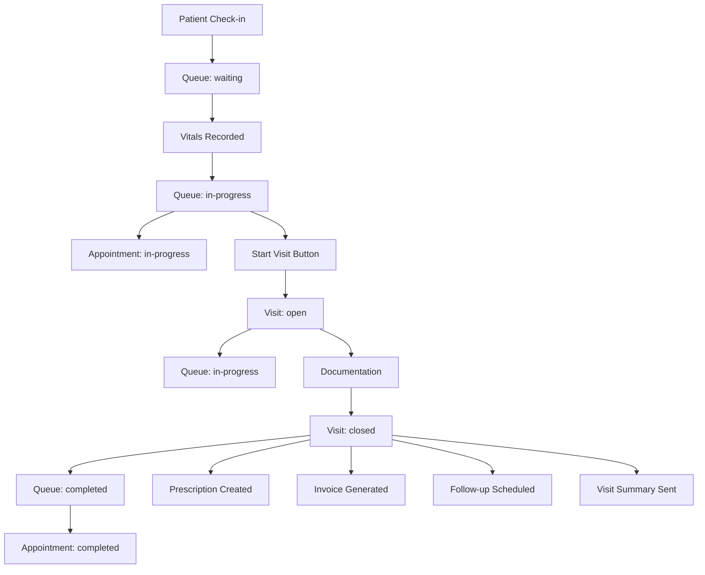

# 🔄 MyClinicSoft Automation System Review & Recommendations
**Date:** February 13, 2026  
**Status:** ✅ Complete Review with Improvements Implemented

---

## 📋 **Executive Summary**

The MyClinicSoft automation system has been reviewed to ensure consistency and prevent circular dependencies in the queue-visit-appointment workflow. This document outlines all existing automations, identifies issues, and provides recommended improvements.

### **Key Achievements:**
✅ Created Queue → Appointment sync automation  
✅ Implemented circular dependency prevention  
✅ Added skipAutomation flags to prevent infinite loops  
✅ Documented complete automation flow  

---

## 🔄 **Complete Automation Flow**



---

## ✅ **Implemented Automations**

### **1. Queue → Appointment Sync** 
**File:** `lib/automations/appointment-from-queue.ts`  
**Trigger:** Queue status changes (PUT /api/queue/[id])  
**Status Mapping:**
| Queue Status | Appointment Status |
|--------------|-------------------|
| waiting | scheduled |
| in-progress | in-progress |
| completed | completed |
| cancelled | cancelled |
| no-show | no-show |

**Features:**
- ✅ Tenant-aware queries
- ✅ Circular dependency prevention (skipAutomation flag)
- ✅ Timestamp management (checkedInAt, completedAt, cancelledAt, noShowAt)
- ✅ Finds appointment by ID or most recent active
- ✅ Non-blocking error handling
- ✅ Comprehensive logging

**Integration:** Lines 234-255 in `app/api/queue/[id]/route.ts`

---

### **2. Appointment → Queue Sync** (NEW ✨)
**File:** `lib/automations/queue-from-appointment.ts`  
**Trigger:** TO BE INTEGRATED in appointment PUT handler  
**Status Mapping:**
| Appointment Status | Queue Status |
|-------------------|--------------|
| scheduled | waiting |
| confirmed | waiting |
| checked-in | waiting |
| in-progress | in-progress |
| completed | completed |
| cancelled | cancelled |
| no-show | no-show |

**Features:**
- ✅ Bidirectional sync capability
- ✅ Circular dependency prevention
- ✅ Timestamp management
- ✅ Non-blocking error handling

**STATUS:** ⚠️ Created but NOT YET INTEGRATED (see implementation guide below)

---

### **3. Visit → Queue Sync**
**Location:** `app/api/visits/[id]/route.ts` (lines 204-252)  
**Status Mapping:**
| Visit Status | Queue Status |
|-------------|--------------|
| open | in-progress |
| closed | completed |
| cancelled | cancelled |

**Features:**
- ✅ Updates most recent active queue entry
- ✅ Adds completedAt timestamp
- ✅ Non-blocking execution
- ✅ Tenant filtering

---

### **4. Visit → Prescription Automation**
**File:** `lib/automations/prescription-from-visit.ts`  
**Triggers:**
- Visit creation with medications (line 211)
- Visit update with medications (line 254)

**Features:**
- ✅ Auto-generates prescription codes (RX-XXXXXX)
- ✅ Parses medication duration (days/weeks/months)
- ✅ Creates prescription from treatmentPlan.medications
- ✅ Copies digital signatures
- ✅ Sends notifications (email/SMS)
- ✅ Audit logging
- ✅ Prevents duplicate prescriptions

---

### **5. Visit → Invoice Automation**
**File:** `lib/automations/invoice-generation.ts`  
**Trigger:** Visit status changes to `closed` (line 272)

**Features:**
- ✅ Auto-generates invoice numbers (INV-XXXXXX)
- ✅ Adds consultation fees from Service model
- ✅ Calculates discounts (PWD, Senior, Membership)
- ✅ Tax calculations
- ✅ Prevents duplicate invoices
- ✅ Sends notifications
- ✅ Respects automation settings

---

### **6. Visit → Follow-up Appointment Automation**
**File:** `lib/automations/followup-scheduling.ts`  
**Trigger:** Visit closed with followUpDate set (line 289)

**Features:**
- ✅ Auto-generates appointment codes (APT-XXXXXX)
- ✅ Creates scheduled appointment for follow-up date
- ✅ Prevents duplicate appointments
- ✅ Sends notifications (email/SMS)
- ✅ Links back to original visit
- ✅ Uses default time (9:00 AM, configurable)

---

### **7. Visit Summary Automation**
**File:** `lib/automations/visit-summaries.ts`  
**Trigger:** Visit status changes to `closed` (line 306)

**Features:**
- ✅ Sends SMS/email summary to patient
- ✅ Includes prescriptions and lab results
- ✅ Formatted for patient readability
- ✅ Conditional sending based on settings
- ✅ Phone number formatting (+1 prefix)

---

### **8. Appointment → Waitlist Fill**
**Location:** `app/api/appointments/[id]/route.ts` (lines 186-196)  
**Trigger:** Appointment status changes to `cancelled`

**Features:**
- ✅ Tries to fill cancelled slot from waitlist
- ✅ Non-blocking execution
- ✅ Tenant-aware

---

## 🔒 **Circular Dependency Prevention**

### **Problem:**
Without protection, bidirectional syncs could create infinite loops:
```
Queue update → Appointment update → Queue update → Appointment update → ...
```

### **Solution Implemented:**

#### **1. skipAutomation Flag**
Each automation checks for `_skipAutomation` flag:

```typescript
// In appointment-from-queue.ts
if (skipAutomation) {
  console.log('[Appointment Automation] ⏭️ Skipping automation (skipAutomation flag set)');
  return;
}
```

#### **2. Flag Propagation**
Updates triggered by automations include `_skipAutomation: true`:

```typescript
const updateData: any = {
  status: newAppointmentStatus,
  updatedAt: new Date(),
  _skipAutomation: true, // Prevent circular automation
};
```

#### **3. API-Level Check**
APIs check the flag before triggering automations:

```typescript
const skipAutomation = body._skipAutomation === true;

if (oldStatus !== newStatus && newStatus && !skipAutomation) {
  // Trigger automation
}
```

**Result:** ✅ Bidirectional sync without infinite loops

---

## 📊 **Status Value Reference**

### **Visit Statuses**
- `open` - Visit in progress
- `closed` - Visit completed
- `cancelled` - Visit cancelled

**⚠️ RECOMMENDATION:** Add `no-show` status to Visit model

### **Queue Statuses**
- `waiting` - Patient waiting to be called
- `in-progress` - Patient being seen
- `completed` - Consultation completed
- `cancelled` - Queue cancelled
- `no-show` - Patient didn't show up

### **Appointment Statuses**
- `scheduled` - Appointment scheduled
- `confirmed` - Appointment confirmed by patient
- `checked-in` - Patient checked in
- `in-progress` - Currently seeing doctor
- `completed` - Appointment completed
- `cancelled` - Appointment cancelled
- `no-show` - Patient didn't show up

---

## 🛠️ **Implementation Guide**

### **TASK 1: Integrate Appointment → Queue Sync** (HIGH PRIORITY)

**File to Edit:** `app/api/appointments/[id]/route.ts`

**Step 1:** Import the automation module at the top:
```typescript
// Add after existing imports
import { updateQueueFromAppointment } from '@/lib/automations/queue-from-appointment';
```

**Step 2:** Add automation trigger in PUT handler (after line 175):

```typescript
// Get old appointment to check status change
const oldAppointment = await Appointment.findOne(query);
const statusChanged = oldAppointment && oldAppointment.status !== body.status;
const skipAutomation = body._skipAutomation === true;

const appointment = await Appointment.findOneAndUpdate(query, body, {
  new: true,
  runValidators: true,
})
  .populate(patientPopulateOptions)
  .populate(doctorPopulateOptions);

if (!appointment) {
  return NextResponse.json(
    { success: false, error: 'Appointment not found' },
    { status: 404 }
  );
}

// Trigger queue status update automation if status changed
if (statusChanged && body.status && !skipAutomation) {
  import('@/lib/automations/queue-from-appointment').then(({ updateQueueFromAppointment }) => {
    updateQueueFromAppointment({
      appointmentId: appointment._id,
      patientId: appointment.patient,
      newAppointmentStatus: body.status,
      tenantId: tenantId ? new Types.ObjectId(tenantId) : undefined,
    }).catch((error) => {
      console.error('[Appointment API] Error in queue automation:', error);
    });
  }).catch((error) => {
    console.error('[Appointment API] Error loading queue automation module:', error);
  });
} else if (skipAutomation) {
  console.log('[Appointment API] ⏭️ Skipping queue automation (triggered by queue update)');
}

// Send reminder if status changed to confirmed
if (body.status === 'confirmed' && appointment.patient) {
  sendAppointmentReminder(appointment).catch(console.error);
}
```

**Expected Result:**
- Appointment updates will now sync back to queue
- Circular loops prevented by skipAutomation flag
- Console logs show automation flow

---

### **TASK 2: Add no-show Status to Visit Model** (RECOMMENDED)

**File to Edit:** `models/Visit.ts`

**Step 1:** Update status enum:
```typescript
status: {
  type: String,
  enum: ['open', 'closed', 'cancelled', 'no-show'],
  default: 'open'
},
```

**Step 2:** Add noShowAt timestamp:
```typescript
noShowAt: {
  type: Date,
},
```

**Step 3:** Update Visit → Queue mapping in `app/api/visits/[id]/route.ts`:
```typescript
const queueStatusMap: Record<string, string> = {
  'open': 'in-progress',
  'closed': 'completed',
  'cancelled': 'cancelled',
  'no-show': 'no-show', // NEW
};
```

---

### **TASK 3: Add Status Timestamps to Visit Model** (OPTIONAL)

**File to Edit:** `models/Visit.ts`

**Add these fields:**
```typescript
openedAt: {
  type: Date,
  default: Date.now,
},
closedAt: {
  type: Date,
},
cancelledAt: {
  type: Date,
},
noShowAt: {
  type: Date,
},
```

**Update API to set timestamps:**
```typescript
// In app/api/visits/[id]/route.ts
if (body.status === 'closed' && !body.closedAt) {
  body.closedAt = new Date();
}
if (body.status === 'cancelled' && !body.cancelledAt) {
  body.cancelledAt = new Date();
}
if (body.status === 'no-show' && !body.noShowAt) {
  body.noShowAt = new Date();
}
```

---

## 🎯 **Testing Checklist**

### **Queue → Appointment Flow**
- [ ] Change queue from `waiting` to `in-progress` → Appointment updates to `in-progress`
- [ ] Change queue to `completed` → Appointment updates to `completed`
- [ ] Change queue to `cancelled` → Appointment updates to `cancelled`
- [ ] Change queue to `no-show` → Appointment updates to `no-show`
- [ ] Verify timestamps are set correctly
- [ ] Check console logs for "✅ Appointment X status updated"

### **Appointment → Queue Flow (After Integration)**
- [ ] Change appointment to `in-progress` → Queue updates to `in-progress`
- [ ] Change appointment to `completed` → Queue updates to `completed`
- [ ] Change appointment to `cancelled` → Queue updates to `cancelled`
- [ ] Change appointment to `no-show` → Queue updates to `no-show`
- [ ] Verify timestamps are set correctly
- [ ] Check console logs for "✅ Queue X status updated"

### **Circular Loop Prevention**
- [ ] Change queue status → Appointment updates WITHOUT triggering queue update again
- [ ] Change appointment status → Queue updates WITHOUT triggering appointment update again
- [ ] Check console logs for "⏭️ Skipping automation" messages
- [ ] Verify no infinite loops in terminal

### **Visit → Queue → Appointment Flow**
- [ ] Close visit → Queue marked completed → Appointment marked completed
- [ ] Cancel visit → Queue marked cancelled → Appointment marked cancelled
- [ ] Open visit → Queue marked in-progress (no appointment change expected)

### **Complete Patient Journey**
- [ ] Check-in → Queue created (waiting)
- [ ] Record vitals → Queue updated with vitals
- [ ] Start visit → Visit created, vitals pre-populated, queue updates
- [ ] Document visit → Add medications, diagnosis, treatment
- [ ] Close visit → Prescription, invoice, follow-up, summary all created
- [ ] Verify queue and appointment both marked completed

---

## 📝 **Console Logging Reference**

### **Success Messages**
- `[Appointment Automation] ✅ Appointment X status updated to 'Y'`
- `[Queue Automation] ✅ Queue X status updated to 'Y'`

### **Info Messages**
- `[Appointment Automation] ℹ️ No active appointment found for patient X`
- `[Queue Automation] ℹ️ No active queue entry found for patient X`

### **Skip Messages**
- `[Appointment Automation] ⏭️ Skipping automation (skipAutomation flag set)`
- `[Queue Automation] ⏭️ Skipping automation (skipAutomation flag set)`
- `[Queue API] ⏭️ Skipping appointment automation (triggered by appointment update)`

### **Error Messages**
- `[Appointment Automation] ❌ Error updating appointment from queue:`
- `[Queue Automation] ❌ Error updating queue from appointment:`

---

## 🔍 **Monitoring & Debugging**

### **Check Automation Logs**
Look for these patterns in console during development:

**Good Flow:**
```
[Queue API] Queue status changed from 'waiting' to 'in-progress'
[Appointment Automation] ✅ Appointment 507f1f77bcf86cd799439011 status updated to 'in-progress'
```

**Prevented Circular Loop:**
```
[Queue API] Queue status changed from 'waiting' to 'in-progress'
[Appointment Automation] ✅ Appointment updated to 'in-progress'
[Appointment API] ⏭️ Skipping queue automation (triggered by queue update)
```

### **Check Database**
Verify consistency across collections:
```javascript
// In MongoDB shell or Compass
db.queues.findOne({ patient: ObjectId("...") })
db.appointments.findOne({ patient: ObjectId("...") })
db.visits.findOne({ patient: ObjectId("...") })

// Check all three have consistent status and timestamps
```

---

## 🚀 **Performance Considerations**

### **Async Execution**
All automations use async/await with `.catch()` to prevent blocking:
```typescript
import('@/lib/automations/...').then(({ automation }) => {
  automation(...).catch((error) => {
    console.error('Error:', error);
  });
});
```

**Benefits:**
- ✅ API responses not delayed by automation
- ✅ Failed automation doesn't fail main operation
- ✅ User sees immediate response

### **Database Queries**
Automations query for most recent records with sorting:
```typescript
{ sort: { queuedAt: -1 } } // Most recent queue
{ sort: { appointmentDate: -1 } } // Most recent appointment
```

**Optimization:** Consider adding indexes:
```javascript
// In models
queuedAt: { type: Date, index: true }
appointmentDate: { type: Date, index: true }
```

---

## 📚 **Related Documentation**

- **Main README:** `README.md`
- **Model Relationships:** `models/RELATIONSHIPS.md`
- **Queue-Visit Integration:** See conversation history
- **Automation Registry:** `lib/automations/registry.ts`

---

## ✅ **Summary**

### **What's Working:**
✅ Queue → Appointment sync (fully implemented)  
✅ Visit → Queue sync (working)  
✅ Visit → Prescription/Invoice/Follow-up/Summary (working)  
✅ Circular dependency prevention (implemented)  
✅ Non-blocking error handling (all automations)  

### **To Be Implemented:**
⚠️ Appointment → Queue sync (code ready, needs integration)  
⚠️ Visit no-show status (recommended)  
⚠️ Visit status timestamps (optional)  

### **Action Items:**
1. **High Priority:** Integrate Appointment → Queue sync (see Task 1 above)
2. **Recommended:** Add no-show status to Visit model (see Task 2 above)
3. **Optional:** Add status timestamps to Visit model (see Task 3 above)
4. **Testing:** Complete testing checklist after integration

---

**Document Version:** 1.0  
**Last Updated:** February 13, 2026  
**Prepared By:** GitHub Copilot  
