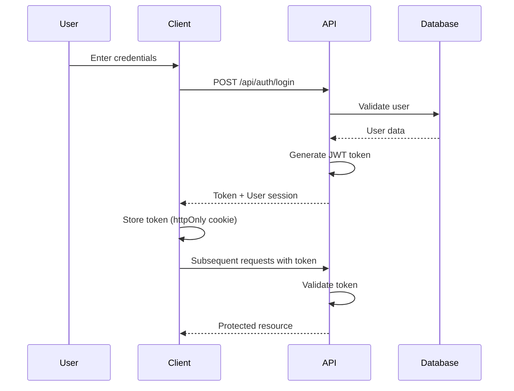

# Security & Authentication Guide

## Overview

MyClinicSoft implements a comprehensive security architecture with JWT-based authentication, role-based access control (RBAC), and multi-tenant data isolation.

---

## Table of Contents

1. [Authentication System](#authentication-system)
2. [Authorization & RBAC](#authorization--rbac)
3. [Session Management](#session-management)
4. [Password Security](#password-security)
5. [API Security](#api-security)
6. [Multi-Tenant Security](#multi-tenant-security)
7. [Security Best Practices](#security-best-practices)
8. [Common Security Issues](#common-security-issues)

---

## Authentication System

### Authentication Flow



### Login Implementation

**Location**: `app/actions/auth.ts`

```typescript
// Login action
export async function login(email: string, password: string) {
  // 1. Validate credentials
  const user = await User.findOne({ email }).populate('role');
  
  // 2. Check password
  const isValid = await bcrypt.compare(password, user.password);
  
  // 3. Generate JWT token
  const token = jwt.sign(
    { 
      userId: user._id, 
      email: user.email,
      role: role?.name || 'receptionist',
      tenantId: user.tenantId 
    },
    session.JWT_SECRET,
    { expiresIn: '24h' }
  );
  
  // 4. Set session cookie
  cookies().set('session-token', token, {
    httpOnly: true,
    secure: process.env.NODE_ENV === 'production',
    sameSite: 'lax',
    maxAge: 60 * 60 * 24 // 24 hours
  });
  
  return { success: true, user };
}
```

### JWT Token Structure

```json
{
  "userId": "507f1f77bcf86cd799439011",
  "email": "doctor@clinic.com",
  "role": "doctor",
  "tenantId": "507f1f77bcf86cd799439012",
  "iat": 1707843200,
  "exp": 1707929600
}
```

### Authentication Middleware

**Location**: `lib/auth-helpers.ts`

```typescript
export async function getServerSession(): Promise<Session | null> {
  try {
    const token = cookies().get('session-token')?.value;
    if (!token) return null;
    
    const decoded = jwt.verify(token, process.env.JWT_SECRET);
    return {
      userId: decoded.userId,
      email: decoded.email,
      role: decoded.role,
      tenantId: decoded.tenantId
    };
  } catch (error) {
    return null;
  }
}

export async function requireAuth(): Promise<Session> {
  const session = await getServerSession();
  if (!session) {
    redirect('/login');
  }
  return session;
}
```

---

## Authorization & RBAC

### Role Hierarchy

```
┌─────────────────────────────────────┐
│             Admin                    │ Level 100
│  - Full system access                │
│  - User management                   │
│  - System configuration              │
└─────────────────────────────────────┘
              ↓
┌─────────────────────────────────────┐
│             Doctor                    │ Level 80
│  - Patient management                │
│  - Clinical visits                   │
│  - Prescriptions                     │
│  - Lab results                       │
└─────────────────────────────────────┘
              ↓
┌─────────────────────────────────────┐
│             Nurse                     │ Level 60
│  - Patient vitals                    │
│  - Lab results (read)                │
│  - Queue management                  │
└─────────────────────────────────────┘
              ↓
┌─────────────────────────────────────┐
│          Receptionist                 │ Level 40
│  - Appointments                      │
│  - Patient registration              │
│  - Queue management                  │
└─────────────────────────────────────┘
              ↓
┌─────────────────────────────────────┐
│          Accountant                   │ Level 30
│  - Billing                           │
│  - Invoices                          │
│  - Payment tracking                  │
└─────────────────────────────────────┘
```

### Default Role Permissions

**Location**: `lib/default-permissions.ts`

#### Admin Permissions
```typescript
{
  role: 'admin',
  permissions: [
    { resource: 'users', actions: ['create', 'read', 'update', 'delete'] },
    { resource: 'patients', actions: ['create', 'read', 'update', 'delete'] },
    { resource: 'appointments', actions: ['create', 'read', 'update', 'delete'] },
    { resource: 'visits', actions: ['create', 'read', 'update', 'delete'] },
    { resource: 'prescriptions', actions: ['create', 'read', 'update', 'delete'] },
    { resource: 'invoices', actions: ['create', 'read', 'update', 'delete'] },
    { resource: 'reports', actions: ['create', 'read', 'update', 'delete'] },
    { resource: 'settings', actions: ['create', 'read', 'update', 'delete'] },
    { resource: 'roles', actions: ['create', 'read', 'update', 'delete'] },
    { resource: 'inventory', actions: ['create', 'read', 'update', 'delete'] }
  ]
}
```

#### Doctor Permissions
```typescript
{
  role: 'doctor',
  permissions: [
    { resource: 'patients', actions: ['create', 'read', 'update'] },
    { resource: 'appointments', actions: ['read', 'update'] },
    { resource: 'visits', actions: ['create', 'read', 'update'] },
    { resource: 'prescriptions', actions: ['create', 'read', 'update'] },
    { resource: 'lab-results', actions: ['create', 'read'] },
    { resource: 'referrals', actions: ['create', 'read'] },
    { resource: 'queue', actions: ['read', 'update'] }
  ]
}
```

### Permission Checking

```typescript
// Check if user has permission
export function hasPermission(
  session: Session,
  resource: string,
  action: string
): boolean {
  const role = await Role.findById(session.roleId)
    .populate('permissions');
  
  return role.permissions.some(p => 
    p.resource === resource && 
    p.actions.includes(action)
  );
}

// API route protection
export async function requirePermission(
  resource: string,
  action: string
) {
  const session = await requireAuth();
  
  if (!hasPermission(session, resource, action)) {
    throw new Error('Insufficient permissions');
  }
  
  return session;
}
```

### Usage in API Routes

```typescript
export async function POST(req: NextRequest) {
  // Require authentication and permission
  const session = await requirePermission('patients', 'create');
  
  // User has permission, proceed with logic
  const body = await req.json();
  const patient = await Patient.create({
    ...body,
    tenantId: session.tenantId
  });
  
  return NextResponse.json({ success: true, patient });
}
```

---

## Session Management

### Session Configuration

```typescript
// Session settings
const SESSION_CONFIG = {
  secret: process.env.JWT_SECRET,
  tokenExpiry: '24h',
  cookieName: 'session-token',
  cookieOptions: {
    httpOnly: true,
    secure: process.env.NODE_ENV === 'production',
    sameSite: 'lax',
    maxAge: 60 * 60 * 24 // 24 hours
  }
};
```

### Session Storage

Sessions are stored as HTTP-only cookies with JWT tokens. No server-side session storage is required.

**Advantages**:
- Stateless authentication
- Scalable (no session database)
- Works across multiple servers
- Automatic expiration

### Session Refresh

```typescript
// Refresh session (extend expiration)
export async function refreshSession() {
  const session = await getServerSession();
  if (!session) return null;
  
  // Generate new token with extended expiry
  const newToken = jwt.sign(
    session,
    process.env.JWT_SECRET,
    { expiresIn: '24h' }
  );
  
  cookies().set('session-token', newToken, SESSION_CONFIG.cookieOptions);
  return session;
}
```

### Logout

```typescript
export async function logout() {
  cookies().delete('session-token');
  redirect('/login');
}
```

---

## Password Security

### Password Requirements

```typescript
const PASSWORD_POLICY = {
  minLength: 8,
  requireUppercase: true,
  requireLowercase: true,
  requireNumbers: true,
  requireSpecialChars: false,
  preventCommonPasswords: true
};
```

### Password Hashing

```typescript
import bcrypt from 'bcrypt';

// Hash password on user creation
const hashedPassword = await bcrypt.hash(password, 10);

// Verify password on login
const isValid = await bcrypt.compare(inputPassword, hashedPassword);
```

### Password Validation

```typescript
export function validatePassword(password: string): {
  valid: boolean;
  errors: string[];
} {
  const errors: string[] = [];
  
  if (password.length < 8) {
    errors.push('Password must be at least 8 characters');
  }
  if (!/[A-Z]/.test(password)) {
    errors.push('Password must contain uppercase letter');
  }
  if (!/[a-z]/.test(password)) {
    errors.push('Password must contain lowercase letter');
  }
  if (!/[0-9]/.test(password)) {
    errors.push('Password must contain number');
  }
  
  return {
    valid: errors.length === 0,
    errors
  };
}
```

### Password Reset Flow

```typescript
// 1. Request password reset
export async function requestPasswordReset(email: string) {
  const user = await User.findOne({ email });
  
  // Generate reset token
  const resetToken = crypto.randomBytes(32).toString('hex');
  const hashedToken = await bcrypt.hash(resetToken, 10);
  
  // Store token with expiry
  user.resetPasswordToken = hashedToken;
  user.resetPasswordExpires = Date.now() + 3600000; // 1 hour
  await user.save();
  
  // Send email with reset link
  await sendEmail({
    to: email,
    subject: 'Password Reset',
    body: `Reset link: ${process.env.APP_URL}/reset-password?token=${resetToken}`
  });
}

// 2. Reset password
export async function resetPassword(token: string, newPassword: string) {
  const user = await User.findOne({
    resetPasswordExpires: { $gt: Date.now() }
  });
  
  // Verify token
  const isValid = await bcrypt.compare(token, user.resetPasswordToken);
  if (!isValid) throw new Error('Invalid token');
  
  // Update password
  user.password = await bcrypt.hash(newPassword, 10);
  user.resetPasswordToken = undefined;
  user.resetPasswordExpires = undefined;
  await user.save();
}
```

---

## API Security

### Rate Limiting

```typescript
// Rate limit configuration
const RATE_LIMITS = {
  login: { max: 5, window: 15 * 60 * 1000 }, // 5 attempts per 15 min
  api: { max: 100, window: 60 * 1000 },      // 100 requests per minute
  public: { max: 50, window: 60 * 1000 }     // 50 requests per minute
};
```

### CORS Configuration

```typescript
// cors.ts
const CORS_CONFIG = {
  origin: process.env.ALLOWED_ORIGINS?.split(',') || '*',
  methods: ['GET', 'POST', 'PUT', 'DELETE', 'PATCH'],
  allowedHeaders: ['Content-Type', 'Authorization'],
  credentials: true,
  maxAge: 86400 // 24 hours
};
```

### Input Validation

```typescript
import { z } from 'zod';

const patientSchema = z.object({
  firstName: z.string().min(1).max(100),
  lastName: z.string().min(1).max(100),
  email: z.string().email().optional(),
  phone: z.string().regex(/^\+?[0-9]{10,15}$/),
  dateOfBirth: z.string().datetime()
});

export async function POST(req: NextRequest) {
  const body = await req.json();
  
  // Validate input
  const validated = patientSchema.parse(body);
  
  // Proceed with validated data
  const patient = await Patient.create(validated);
}
```

### SQL Injection Prevention

MongoDB with Mongoose provides built-in protection against injection attacks through:
- Query parameterization
- Type validation
- Schema enforcement

```typescript
// Safe query (parameterized)
const patient = await Patient.findOne({ 
  email: userInput // Mongoose sanitizes this
});

// Avoid raw queries with user input
// ❌ NEVER DO THIS
const result = await mongoose.connection.db
  .collection('patients')
  .find({ $where: userInput }); // DANGEROUS!
```

### XSS Prevention

```typescript
// Sanitize HTML content
import DOMPurify from 'isomorphic-dompurify';

export function sanitizeHtml(dirty: string): string {
  return DOMPurify.sanitize(dirty, {
    ALLOWED_TAGS: ['b', 'i', 'em', 'strong', 'p', 'br'],
    ALLOWED_ATTR: []
  });
}

// Usage in visit notes
visit.notes = sanitizeHtml(userInput);
```

---

## Multi-Tenant Security

### Subdomain Validation

```typescript
export async function getTenantFromSubdomain(
  req: NextRequest
): Promise<string | null> {
  const host = req.headers.get('host') || '';
  const subdomain = host.split('.')[0];
  
  // Validate subdomain format
  if (!/^[a-z0-9-]+$/.test(subdomain)) {
    return null;
  }
  
  // Find tenant
  const tenant = await Tenant.findOne({ 
    subdomain,
    status: 'active'
  });
  
  return tenant?._id || null;
}
```

### Tenant Data Isolation

```typescript
// Automatic tenant filtering
export async function findWithTenant<T>(
  model: Model<T>,
  query: any,
  tenantId: string
) {
  return model.find({
    ...query,
    tenantId: new Types.ObjectId(tenantId)
  });
}

// Usage in API routes
export async function GET(req: NextRequest) {
  const session = await requireAuth();
  
  // All queries automatically filtered by tenant
  const patients = await Patient.find({
    tenantId: session.tenantId,
    status: 'active'
  });
  
  return NextResponse.json({ patients });
}
```

### Cross-Tenant Access Prevention

```typescript
// Verify resource belongs to user's tenant
export async function requireTenantOwnership(
  resourceId: string,
  session: Session
) {
  const resource = await Resource.findById(resourceId);
  
  if (!resource) {
    throw new Error('Resource not found');
  }
  
  if (resource.tenantId.toString() !== session.tenantId) {
    throw new Error('Access denied: Resource belongs to different tenant');
  }
  
  return resource;
}
```

---

## Security Best Practices

### Environment Variables

```bash
# .env.local
JWT_SECRET=<strong-random-secret>           # Generate with: openssl rand -base64 32
MONGODB_URI=<connection-string>
ENCRYPTION_KEY=<32-byte-key>                # For sensitive data encryption
SESSION_SECRET=<random-secret>

# Never commit .env.local to git
# Use different secrets for development and production
```

### HTTPS in Production

```typescript
// Enforce HTTPS in production
if (process.env.NODE_ENV === 'production' && !req.url.startsWith('https://')) {
  return NextResponse.redirect(`https://${req.headers.get('host')}${req.url}`);
}
```

### Security Headers

```typescript
// next.config.ts
const securityHeaders = [
  {
    key: 'X-DNS-Prefetch-Control',
    value: 'on'
  },
  {
    key: 'Strict-Transport-Security',
    value: 'max-age=63072000; includeSubDomains; preload'
  },
  {
    key: 'X-Frame-Options',
    value: 'SAMEORIGIN'
  },
  {
    key: 'X-Content-Type-Options',
    value: 'nosniff'
  },
  {
    key: 'X-XSS-Protection',
    value: '1; mode=block'
  },
  {
    key: 'Referrer-Policy',
    value: 'origin-when-cross-origin'
  }
];
```

### Secure File Uploads

```typescript
const ALLOWED_FILE_TYPES = [
  'image/jpeg',
  'image/png',
  'application/pdf',
  'application/msword'
];

const MAX_FILE_SIZE = 10 * 1024 * 1024; // 10MB

export async function validateFileUpload(file: File) {
  // Check file type
  if (!ALLOWED_FILE_TYPES.includes(file.type)) {
    throw new Error('Invalid file type');
  }
  
  // Check file size
  if (file.size > MAX_FILE_SIZE) {
    throw new Error('File too large');
  }
  
  // Scan for malware (if available)
  // await scanFile(file);
  
  return true;
}
```

---

## Common Security Issues

### Issue 1: Exposed Sensitive Data

❌ **Wrong**:
```typescript
return NextResponse.json({ user }); // Includes password hash!
```

✅ **Correct**:
```typescript
const { password, ...safeUser } = user.toObject();
return NextResponse.json({ user: safeUser });
```

### Issue 2: Missing Tenant Filter

❌ **Wrong**:
```typescript
const patient = await Patient.findById(patientId);
// Patient from any tenant!
```

✅ **Correct**:
```typescript
const patient = await Patient.findOne({
  _id: patientId,
  tenantId: session.tenantId
});
```

### Issue 3: Weak Password Validation

❌ **Wrong**:
```typescript
if (password.length >= 6) {
  // Too weak!
}
```

✅ **Correct**:
```typescript
const validation = validatePassword(password);
if (!validation.valid) {
  return NextResponse.json({ 
    error: validation.errors 
  }, { status: 400 });
}
```

### Issue 4: Missing Input Sanitization

❌ **Wrong**:
```typescript
visit.notes = req.body.notes; // XSS vulnerability!
```

✅ **Correct**:
```typescript
visit.notes = sanitizeHtml(req.body.notes);
```

---

## Security Checklist

### Development
- [ ] Use environment variables for all secrets
- [ ] Implement input validation on all endpoints
- [ ] Add tenant filtering to all queries
- [ ] Sanitize user-generated content
- [ ] Hash all passwords with bcrypt
- [ ] Use HTTPS in production
- [ ] Implement rate limiting
- [ ] Add security headers
- [ ] Validate file uploads
- [ ] Log security events

### Code Review
- [ ] No hardcoded secrets
- [ ] All endpoints require authentication
- [ ] Permission checks on sensitive operations
- [ ] Tenant isolation enforced
- [ ] No SQL/NoSQL injection vulnerabilities
- [ ] XSS prevention implemented
- [ ] CSRF protection enabled
- [ ] Error messages don't leak sensitive info

### Deployment
- [ ] Change all default secrets
- [ ] Enable HTTPS
- [ ] Configure firewall rules
- [ ] Set up monitoring
- [ ] Enable audit logging
- [ ] Regular security updates
- [ ] Backup encryption
- [ ] Disaster recovery plan

---

## Resources

- [OWASP Top 10](https://owasp.org/www-project-top-ten/)
- [JWT Best Practices](https://tools.ietf.org/html/rfc8725)
- [Next.js Security](https://nextjs.org/docs/app/building-your-application/authentication)
- [MongoDB Security](https://www.mongodb.com/docs/manual/security/)

---

**Last Updated**: February 13, 2026  
**Version**: 1.0.0
